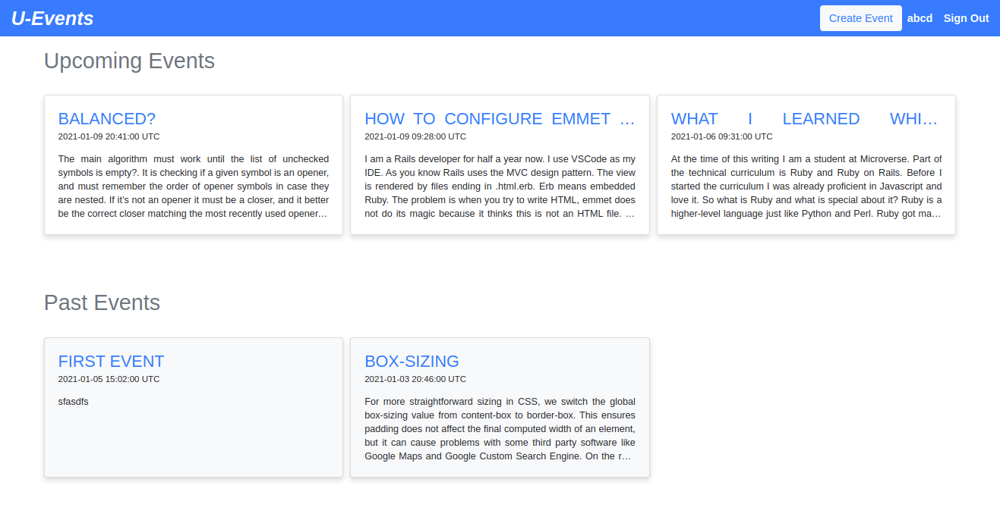

# Private-Events



## About the Project

This is a private-events project using Ruby on Rails.  This project is a building of a private EventBrite which allows users to create events and then manage user signups. Users can create events and send invitations and parties. Events take place at a specific date and at a location.

## Live Demo
Checkout the live demo at [Live](https://stark-springs-82794.herokuapp.com/)

### Built With

- [Rails](https://guides.rubyonrails.org/)
- [Ruby](https://www.ruby-lang.org/en/)
- HTML
- Bootstrap
- SQLite3


## Getting Started

To get a local copy up and running follow these simple example steps.

1. If you're running the Windows Operating System, open your command prompt. On Linux, Open your terminal.

2. Copy and paste the following code into the Terminal:

   ```https://github.com/Div685/Private-Events.git ```

3. Press Enter.

4. Once the repository has been cloned, navigate inside the repository

5. After you will need to update and install some of the depedency. Use following command to install the packages
 - `bundle install`
 - `yarn install`
 - `rake db:migrate`

6. once you install the packages and migrate the database you can run the server
 - `rails s` or `rails server`

7. Enjoy


## Contributing

Contributions, issues, and feature requests are welcome!
Feel free to check the [issues page](../../issues).

## Show your support

Give a ⭐️ if you like this project!


## Author

👤 **Mian Faizan Ali Full Stack Programmer**

- GitHub: [@Faizanalifullstackprogrammer](https://github.com/Faizanalifullstackprogrammer)
- Twitter: [@mianfaizanali](https://twitter.com/mianfaizanali)
- LinkedIn: [Mianfaizanali](https://pk.linkedin.com/in/mianfaizanali)


## Acknowledgments

- [Ruby-doc](https://ruby-doc.org/core-2.6.5)
- [Rails-doc](https://guides.rubyonrails.org/)
